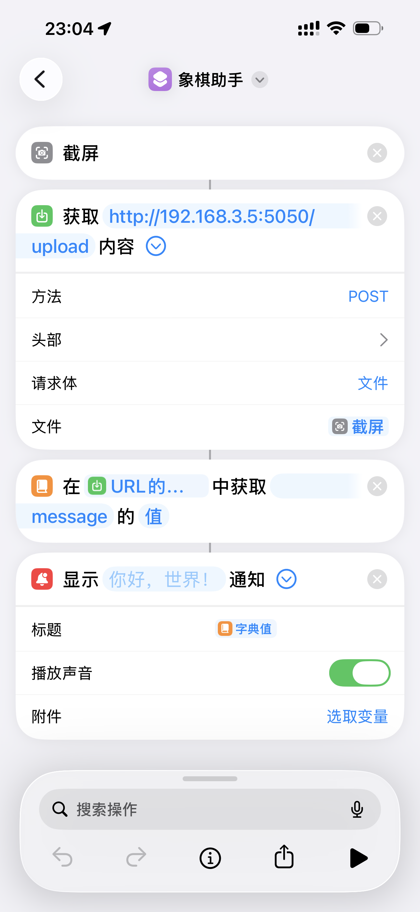

# Chess Helper - 中国象棋AI助手

一个基于计算机视觉和AI的中国象棋助手，可以帮助你分析棋局并提供最佳走法建议；支持天天象棋和JJ象棋。

## 功能特点

- 🎯 实时棋局识别：通过手机截图自动识别棋盘和棋子位置
- 🤖 AI分析：使用强大的Pikafish引擎进行棋局分析
- 🔄 自动检测：自动识别棋局变化，及时提供建议
- 📱 中文输出：将AI建议转换为易于理解的中文描述
- ⚡ 快速响应：优化算法确保快速准确的识别和分析
- 🎯后续更新：将支持更多设备使用，加入更多强大的象棋引擎

## 技术栈

- Python
- OpenCV - 图像处理和计算机视觉
- Pikafish - 中国象棋AI引擎
- Flask - Web服务框架

## 安装说明

1. 克隆仓库：
```bash
git clone https://github.com/yourusername/chess-helper.git
cd chess-helper
```

2. 安装依赖：
```bash
pip install -r requirements.txt
```

3. 准备 Pikafish 引擎：
   > Pikafish编译及用法可参考：https://github.com/official-pikafish/Pikafish
   > 将解压后的 Pikafish 文件放到项目根目录的 `Pikafish/`，并确保当前系统对应的可执行文件有执行权限。
```bash
chmod +x ./Pikafish/MacOS/*
```

4. 运行应用：
```bash
python run.py
```

## 使用说明

### iPhone 快捷指令配置

可以在 iPhone 上创建一个快捷指令，用截图直接请求本机局域网服务。



1. 添加「截屏」操作。
2. 添加「获取 URL 内容」操作。
   - URL：`http://电脑局域网IP:5050/upload`
   - 方法：`POST`
   - 请求体：`文件`
   - 文件：选择上一步的「截屏」
3. 添加「获取字典值」操作。
   - 字典：选择上一步返回的「URL 的内容」
   - 键：`message`
4. 添加「显示通知」操作。
   - 标题：选择上一步取出的「字典值」
   - 播放声音：按需开启

电脑和 iPhone 需要连接同一个局域网。电脑局域网 IP 可以在服务启动日志里查看，例如 `http://192.168.3.5:5050/upload`。

## 项目结构

```
chess-helper/
├── app/
│   ├── main.py          # 主程序入口
│   ├── recognition.py   # 图像识别模块
│   ├── engine.py        # AI引擎接口
│   ├── utils.py         # 工具函数
│   ├── routes.py        # Web路由
│   ├── json/            # 配置文件
│   └── images/          # 图像资源
└── README.md
```

## 贡献指南

欢迎提交Issue和Pull Request来帮助改进项目。在提交PR之前，请确保：

1. 代码符合PEP 8规范
2. 添加必要的测试
3. 更新相关文档

## 许可证

MIT license

## 致谢

- Pikafish引擎开发团队
- OpenCV社区
- 所有贡献者 
- VTEXS
- www.vtexs.com
